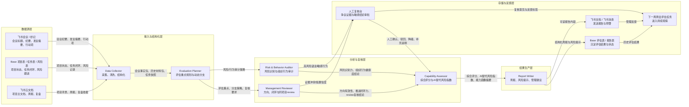

# 中层领导评估 Agent PRD

## 0. 产品概述

### 产品名称

**Manager Insight Agent / 中层管理效能洞察 Agent**

### 产品定位

当前 MVP 聚焦产品/研发项目周会场景，基于飞书会议纪要/妙记、多维表格中的项目任务风险数据，以及项目主文档、周报、复盘，对项目型中层负责人在项目推进中的管理行为进行持续观察、证据校验、能力评估和风险提示，并输出结构化报告与改进建议。

### 核心价值

- 将管理评估从主观印象转为证据驱动
- 将“开会表现”与“任务闭环结果”打通
- 将单场会议判断升级为“同项目近 3 到 5 场会议复核”的持续观察
- 为上级管理者、HRBP、PMO 提供更可解释的管理洞察

### 产品表现形式

本产品不是独立 App，也不是单纯聊天机器人，而是一个运行在飞书内的“管理效能评估工作台 + Agent 自动化流程”。

1. **飞书 Base 工作台**

- 作为主入口，承载项目、会议、评估任务、证据链、人工复核项和报告状态
- HRBP、PMO、上级管理者可在 Base 中查看 Agent 运行进度、证据来源和最终结论

1. **飞书机器人**

- 用于任务触发、状态提醒和人工复核通知
- 在高风险语言、证据冲突、AI 替代风险偏高等场景下提醒人工介入

1. **飞书云文档报告**

- 用于沉淀正式成果
- 输出 HRBP 版、PMO 版、上级摘要版和中层自查版报告

1. **人工复核台**

- 通过 Base 视图承载争议证据和敏感结论审批
- 人可以对 Agent 结论执行确认、驳回、降级、补充说明等动作

因此，系统不是“用户问一句、Agent 答一句”的问答工具，而是一个状态驱动的业务系统：

`会议产生数据 -> Base 状态更新 -> Agent 分析与复核 -> 人工决策介入 -> 报告生成 -> 结果回写 -> 下一轮跟踪`

### 系统架构图

 

架构说明

- 数据源层一共 3 类数据：`会议/妙记`、`Base 项目任务风险`、`项目文档`
- 执行层由 `脚本节点 + 规划节点 + 4 个 LLM Agent + 人工复核台` 组成
- 脚本节点：`Data Collector`
- 规划节点：`Evaluation Planner`，用于决定本次重点评估方向和是否进入人工复核
- 分析/汇总 Agent：`Management Reviewer`、`Risk & Behavior Auditor`、`Capability Assessor`、`Report Writer`
- 核心信息流转路径是：
  `原始协作数据 -> 结构化事实 -> 动态规划 -> 方向/闭环/review复核 + 风险/行为审计 -> 人工复核 -> 综合评分与AI替代风险指数 -> 报告回写与发送 -> 下一轮持续观察`

### 技术分工原则

本系统遵循一个明确原则：

**不要让大模型去做稳定、重复、确定的工作，只把需要理解、判断、归纳、解释的工作留给 Agent。**

因此实现分为三层：

1. `脚本模块`

- 负责调度、API 读写、数据清洗、候选召回、状态流转、规划规则、结果回写

1. `工具模块`

- 负责检索、文档切片、结构化校验、模板渲染

1. `LLM Agent 模块`

- 负责语义理解、证据判断、跨会议一致性分析、能力归因、报告生成

在当前 MVP 中：

- `Data Collector` 优先做成脚本化工作流节点
- `Evaluation Planner` 优先做成规则 + 轻量 LLM 判断节点，不作为独立员工 Agent 展示
- 真正需要大模型推理的角色聚焦于：
  `Management Reviewer`、`Risk & Behavior Auditor`、`Capability Assessor`、`Report Writer`

***

## 1. 任务定义

### 1.1 任务名

`中层管理效能评估任务`

### 1.2 触发条件

当前 MVP 的任务触发分为四类：

1. **事件触发**

- 新会议纪要/妙记生成
- 项目周会结束
- 关键项目状态更新
- 风险任务逾期或升级

1. **周期触发**

- 每周固定生成周报
- 项目周会结束后自动生成单次评估

1. **人工触发**

- 管理者上级主动发起评估
- PMO/HRBP 对某项目负责人发起专项审查

1. **风险触发**

- 连续多次会议无有效行动项
- 管理者发言与项目事实冲突
- 项目延期加剧且缺少纠偏动作

### 1.3 完成标准

满足以下条件，任务视为完成：

1. 已获取目标管理者在指定周期内的相关数据
2. 已完成会议发言、项目任务/风险、文档依据的结构化抽取
3. 已完成同项目最近 3 到 5 场会议的 review 复核
4. 已完成 4 个核心主维度评估与 1 个校正项判断
5. 已处理所有命中规则的人工复核项，或明确进入降级状态
6. 已生成至少一份结构化结论：

- 周报
- 风险提示

1. 已将结果、复核状态和反馈入口回写至多维表格，并同步至飞书指定对象
2. 所有关键判断均保留证据链、置信度和人工复核记录

### 1.4 失败标准

满足以下任一条件，任务视为失败或未完成：

1. 无法获取必要数据源，导致结论不成立
2. 证据不足但仍试图输出高确定性结论
3. 未完成同项目历史会议复核却直接输出高风险定性结论
4. 未完成 Base 回写，导致流程中断
5. 生成结论缺少依据说明或引用错误
6. 越权访问敏感数据
7. 超过任务时限仍未进入可交付状态

***

## 2. 代理边界

### 2.1 由 Agent 负责

1. 自动拉取和整理授权范围内的数据
2. 将非结构化内容转为结构化事实
3. 根据会议和项目状态规划本次评估重点
4. 提炼会议中的管理方向、闭环动作、风险信号与组织行为信号
5. 拉取同项目最近 3 到 5 场会议与项目结果做同项目复核
6. 对证据冲突、低置信度、高风险语言生成待人工复核项
7. 基于既定规则和模型输出方向有效性、闭环力、风险识别力、组织行为健康度及 AI 替代风险指数
8. 生成周报、风险提示、阶段性建议
9. 将结果写入 Base、文档、消息通道
10. 对历史结果做连续追踪和趋势分析

### 2.2 由人负责

1. 定义评估目的、适用范围、使用对象
2. 配置数据权限和审批规则
3. 审核高风险或高影响结论
4. 决定是否基于报告进行管理动作
5. 修订评估维度、权重和治理规则
6. 处理争议和例外情况
7. 对 Agent 输出进行反馈标注，帮助后续调优

### 2.3 明确不由 Agent 负责

1. 不直接做干部任免、人事处分、绩效定级
2. 不评估人格、情绪、忠诚度等不可验证特质
3. 不在证据不足时进行推断性定罪
4. 不绕过审批直接访问未授权数据

***

## 3. Agent 设计

当前 MVP 固定为 `1 个脚本节点 + 4 个 LLM Agent`，共同围绕“产品/研发项目周会中的项目型中层负责人评估”这一单一场景协同工作。该版本保留同项目 review 机制，同时合并能力相近的分析角色，降低链路复杂度。

### 3.1 Agent 名称总览

1. `Data Collector`（脚本化节点）
2. `Evaluation Planner`（规划节点，规则 + 轻量 LLM，不作为独立员工 Agent 展示）
3. `Management Reviewer`（LLM Agent）
4. `Risk & Behavior Auditor`（LLM Agent）
5. `Capability Assessor`（LLM Agent）
6. `Report Writer`（LLM Agent）

说明：

- `Data Collector` 在工程上优先实现为脚本化节点
- `Evaluation Planner` 是流程规划节点，用于动态决定本次评估重点、分支路径和人工复核要求
- 其余 4 个角色为 LLM Agent，其中前 2 个负责分析与 review，后 2 个负责综合评估与报告输出

### 3.2 Agent 职责定义

#### 节点 1：Data Collector

职责：

- 拉取当前会议妙记、项目主文档、周报、复盘、同项目历史会议材料
- 读取 Base 中的项目、任务、风险、结果状态数据
- 将非结构化内容转成统一结构化事实包
- 为后续 Agent 准备 `raw_payload`、`history_bundle`、`meeting_fact_pack`

实现建议：

- 优先用脚本和规则实现
- 只在必要时调用抽取工具
- 不承担高层语义判断和归因

输入：

- 当前会议原始妙记
- 项目文档集合
- 同项目历史会议材料
- Base 项目/任务/风险/结果快照

输出：

- `raw_payload`
- `history_bundle`
- `meeting_fact_pack`

#### 节点 2：Evaluation Planner

职责：

- 根据当前会议、项目状态、风险变化和历史评估结果，决定本次评估重点
- 判断是否需要全量评估、轻量周报、专项风险审计或组织行为复核
- 生成后续 Agent 的执行计划和人工复核策略

输入：

- `meeting_fact_pack`
- 项目状态
- 风险等级
- 历史评估结果
- 上一次人工反馈

输出：

- `evaluation_focus`
- `execution_plan`
- `review_requirements`
- `human_review_rules`

说明：

- 该节点用于提升系统复杂度和人机协同感，但不作为独立“员工 Agent”对外展示
- 优先采用规则判断，必要时调用 LLM 做轻量规划

#### Agent 1：Management Reviewer

职责：

- 提炼中层负责人在当前会议中的关键方向、判断、要求和决策口径
- 将这些方向与后续任务状态、复盘结论和项目最终形态进行比对
- 形成方向采纳率、完成率、废止率、回滚率等结论
- 判断会议结论是否沉淀为 owner、DDL、动作和后续跟进
- 调取同项目最近 3 到 5 场会议做 review，检查方向稳定性、闭环连续性和前后矛盾

输入：

- `meeting_fact_pack`
- `history_bundle`
- `execution_plan`
- 项目文档和复盘摘要
- 任务状态和阶段结果快照
- 同项目历史会议中的方向类表述

输出：

- 方向清单
- 方向有效性结论
- 方向证据链
- 行动项清单
- 推进闭环力结论
- review 复核结论
- 方向稳定性和前后矛盾提示

#### Agent 2：Risk & Behavior Auditor

职责：

- 识别当前会议中的风险表述、预警动作和风险升级信号
- 对照项目风险表、周报、复盘和历史会议，判断风险是否被提前识别
- 输出风险命中率、延迟识别情况和缓释动作质量
- 审计会议中的组织行为健康度
- 识别废话密度、重复同步、无效拉扯、打断、甩锅、羞辱性表达等行为

输入：

- `meeting_fact_pack`
- `history_bundle`
- `execution_plan`
- 风险台账和风险处理结果
- 周报/复盘中的风险变化记录
- 当前会议逐轮对话
- 同项目历史会议行为片段

输出：

- 风险信号清单
- 风险识别力结论
- 缓释动作评价
- 高等级风险提示
- 行为审计清单
- 组织行为健康度结论
- 负向行为证据链
- 行为风险等级

#### Agent 3：Capability Assessor

职责：

- 汇总方向有效性、推进闭环力、风险识别力、组织行为健康度四个主维度
- 结合事实依据力作为低权重校正项
- 输出项目熟悉度观察项、管理风险等级和 AI 替代风险指数

输入：

- Management Reviewer 结果
- Risk & Behavior Auditor 结果
- 同项目 review 复核结果

输出：

- 方向有效性得分
- 推进闭环力得分
- 风险识别力得分
- 组织行为健康度得分
- 事实依据力校正分
- 项目熟悉度观察标签
- AI 替代风险指数
- 综合结论

#### Agent 4：Report Writer

职责：

- 输出周报和风险提示
- 将结论转写为适合飞书文档和消息展示的内容
- 回写 Base 报告表

输入：

- Capability Assessor 综合结果
- 关键证据链摘要
- 风险标签和行为提示
- 改进建议草案

输出：

- 管理者周报
- 风险提示
- 改进建议

***

## 4. Base 表结构

当前 MVP 建议使用 9 张核心表，以多维表格作为业务系统底座。其中前 7 张承载业务数据和评估结果，后 2 张承载人工复核和反馈学习。

### 4.1 Projects 项目主表

作用：

- 作为所有会议、任务、风险、评估的主关联表

关键字段：

- `project_id`
- `project_name`
- `business_line`
- `project_stage`
- `manager_id`
- `manager_name`
- `start_date`
- `due_date`
- `health_status`
- `main_doc_url`
- `latest_weekly_report_url`
- `latest_review_doc_url`

### 4.2 Meetings 会议事实表

作用：

- 存储每次项目周会的核心事实和处理状态

关键字段：

- `meeting_id`
- `project_id`
- `meeting_title`
- `meeting_time`
- `participants`
- `manager_speech_summary`
- `decision_summary`
- `risk_summary`
- `action_item_count`
- `initial_status`
- `review_status`

### 4.3 Statements 发言证据表

作用：

- 存储当前会议中的关键发言及其证据链

关键字段：

- `statement_id`
- `meeting_id`
- `project_id`
- `speaker_id`
- `speaker_name`
- `statement_summary`
- `evidence_source_type`
- `evidence_ref`
- `evidence_confidence`
- `fact_check_result`
- `review_meeting_count`

### 4.4 Tasks 任务闭环表

作用：

- 存储和项目周会相关的行动项、负责人、截止时间及闭环状态

关键字段：

- `task_id`
- `project_id`
- `source_meeting_id`
- `task_name`
- `owner`
- `due_date`
- `status`
- `is_overdue`
- `is_closed`
- `close_duration`

### 4.5 Risks 风险与异常表

作用：

- 存储项目风险、风险等级和后续跟进动作

关键字段：

- `risk_id`
- `project_id`
- `meeting_id`
- `risk_type`
- `risk_level`
- `risk_description`
- `trigger_reason`
- `suggested_action`
- `followup_status`

### 4.6 Evaluations 能力评分表

作用：

- 存储每次评估任务的核心维度评分、校正项、AI 替代风险指数和复核结论

关键字段：

- `evaluation_id`
- `project_id`
- `manager_id`
- `current_meeting_id`
- `evaluation_period`
- `direction_effectiveness_score`
- `execution_closure_score`
- `risk_identification_score`
- `behavior_health_score`
- `evidence_correction_score`
- `project_familiarity_observation`
- `ai_replaceability_risk`
- `review_result`
- `human_review_status`
- `overall_summary`

### 4.7 Reports 报告输出表

作用：

- 存储已生成的周报、风险提示及发送状态

关键字段：

- `report_id`
- `project_id`
- `manager_id`
- `evaluation_id`
- `report_type`
- `key_insights`
- `improvement_suggestions`
- `send_status`
- `doc_url`

### 4.8 HumanReviewItems 人工复核表

作用：

- 存储 Agent 生成的争议证据、敏感行为、高风险标签和人工审批结果

关键字段：

- `review_item_id`
- `evaluation_id`
- `project_id`
- `manager_id`
- `trigger_type`
- `evidence_summary`
- `agent_recommendation`
- `risk_level`
- `assignee`
- `review_decision`
- `review_comment`
- `resolved_at`

### 4.9 FeedbackLogs 反馈学习表

作用：

- 存储 HRBP、PMO、上级管理者对报告准确性和表达适配度的反馈，用于后续调优

关键字段：

- `feedback_id`
- `evaluation_id`
- `feedback_role`
- `accuracy_label`
- `severity_label`
- `expression_label`
- `correction_comment`
- `created_at`

### 4.10 表间关系

- `Projects` 关联 `Meetings`
- `Projects` 关联 `Tasks`
- `Projects` 关联 `Risks`
- `Projects` 关联 `Evaluations`
- `Meetings` 关联 `Statements`
- `Meetings` 关联 `Tasks`
- `Meetings` 关联 `Risks`
- `Evaluations` 关联 `Reports`
- `Evaluations` 关联 `HumanReviewItems`
- `Evaluations` 关联 `FeedbackLogs`

***

## 5. 技术任务清单

本项目应拆分为 `脚本模块 / 工具模块 / LLM Agent 模块` 三类任务。

### 5.1 脚本模块任务

这些任务规则清晰、重复度高、可测试，应优先用脚本实现：

1. 任务触发与调度

- 周会结束触发
- 手动触发
- 周期任务调度
- 状态流转控制

1. 评估规划与动态分支

- 根据会议内容、项目状态和历史反馈判断本次评估重点
- 决定是否走轻量周报、全量评估、专项风险审计或人工复核流程
- 生成 `execution_plan` 和 `human_review_rules`

1. 飞书数据访问

- 读取会议纪要/妙记
- 读取 Base 项目、任务、风险
- 读取项目主文档、周报、复盘
- 拉取同项目最近 3 到 5 场会议

1. 数据清洗与标准化

- 时间格式统一
- 人员字段规范化
- 空值处理
- 去重
- 拼接统一中间 JSON

1. review 候选召回

- 只召回同项目会议
- 控制召回窗口为最近 3 到 5 场

1. 指标计算

- 方向采纳率、完成率、废止率、回滚率
- 行动项闭环率
- 风险提及命中率
- 会后任务闭环率
- 延期任务占比
- 冗余发言占比和高风险语言事件数

1. 结果回写

- 写评估结果到 Base
- 写人工复核项到 Base
- 写反馈学习记录到 Base
- 写报告记录到 Base
- 发飞书文档或消息

1. 测试与演示脚本

- 用例 seed 注入
- Base 清空
- 单次回放

### 5.2 工具模块任务

这些任务不适合纯生成，应通过工具调用完成：

1. 检索工具

- 根据发言召回相关任务、风险、文档片段
- 根据当前会议召回同项目历史会议摘要

1. 文档切片工具

- 从项目主文档中提取目标、阶段、风险
- 从周报中提取最新进展
- 从复盘中提取历史问题

1. 结构化校验工具

- 校验 Agent 输出 JSON 是否合法
- 校验字段是否齐全
- 校验分数范围和状态枚举

1. 报告模板渲染工具

- 将评分结果套入周报模板
- 转为飞书文档可写入内容

### 5.3 LLM Agent 模块任务

以下任务最适合由大模型完成：

1. 当前会议事实理解

- 识别哪些发言是关键判断
- 识别哪些内容与项目推进直接相关

1. 管理动作 review

- 判断方向是否被后续结果验证
- 判断行动项是否形成闭环
- 判断同项目历史会议是否支持当前结论

1. 风险与行为审计

- 判断风险是否被提前识别并形成缓释动作
- 判断会议中是否存在废话过多、打断、甩锅、羞辱、辱骂等负向行为

1. 能力归因

- 对核心维度、校正项和 AI 替代风险指数进行解释
- 总结当前最大优势和最大风险

1. 报告生成

- 提炼重点
- 输出管理可读的周报和建议

### 5.4 推荐代码拆分

- `clients/`
  - 飞书 Base、文档、会议访问层
- `tools/`
  - 检索、切片、校验、渲染
- `agents/`
  - Management Reviewer
  - Risk & Behavior Auditor
  - Capability Assessor
  - Report Writer
- `workflows/`
  - 主流程 orchestrator
- `scripts/`
  - seed / clear / demo / scheduler
- `schemas/`
  - 各节点输入输出 JSON schema

### 5.5 推荐开发顺序

1. 先完成脚本层和 schema
2. 再完成飞书数据访问层
3. 再实现 4 个 LLM Agent
4. 最后补 demo 脚本和报告输出

***

## 6. 决策分层

系统中的决策分为目标、过程、执行、签字四层。

### 6.1 目标层

定义：为什么评、评什么、服务谁。

控制方：**人**

负责角色：

- 上级管理者
- HRBP
- PMO
- 系统管理员

Agent 仅接收目标，不自定义组织考核目标。

### 6.2 过程层

定义：采用哪些维度、哪些数据、哪些流程来完成评估。

控制方：**人主导，Agent 辅助**

负责角色：

- 人定义评估框架、权限边界、风险策略
- Agent 按既定框架自动规划分析路径

### 6.3 执行层

定义：拉数、清洗、分析、review 复核、打标签、生成报告、写回 Base。

控制方：**Agent**

负责角色：

- Data Collector
- Management Reviewer
- Risk & Behavior Auditor
- Capability Assessor
- Report Writer

### 6.4 签字层

定义：哪些结论可以正式生效、哪些结论可以发送给谁。

控制方：**人**

负责角色：

- 上级领导
- HRBP
- 项目治理负责人

高风险结论和敏感报告必须由人签字后生效。当前 MVP 不输出组织级横向对比。

***

## 7. 工具权限表

| 工具           | 用途                | 输入                   | 输出            | 风险级别 | 是否需要审批           |
| ------------ | ----------------- | -------------------- | ------------- | ---- | ---------------- |
| 多维表格 OpenAPI | 读写业务主数据、状态、评估结果   | 表 ID、记录 ID、筛选条件、写入字段 | 结构化记录、状态更新结果  | 中    | 否，按应用授权范围        |
| 飞书会议 API     | 获取会议详情、参会人、会议基础信息 | 会议 ID、时间范围、用户标识      | 会议元数据         | 中    | 否，按应用授权范围        |
| 飞书妙记 API     | 获取会议纪要、摘要、要点      | minute token         | 妙记内容、摘要信息     | 高    | 是，需明确授权与审计       |
| 飞书云文档 API    | 读取方案、周报、复盘、输出报告   | 文档 token、查询条件        | 文档内容、生成后的报告链接 | 中    | 读取一般否，写入敏感报告建议审批 |
| 飞书消息/机器人     | 发送提醒、日报、预警、审批请求   | 接收对象、消息模板、报告链接       | 发送结果          | 中    | 面向个人高风险报告时需审批    |
| LLM 评估引擎     | 摘要、证据比对、结论生成      | 结构化事实、提示词、规则         | 标签、评分、解释、报告   | 高    | 否，但需规则约束和日志留存    |

说明：

- 当前 MVP 默认项目任务和风险数据均从 Base 中读取，不单独依赖飞书任务 API。
- 当前 MVP 不引入组织信息接口和跨项目分析能力。

### 风险分级说明

- 低：普通结构化数据处理，对组织影响有限
- 中：涉及项目协作信息和状态流转
- 高：涉及纪要内容、敏感判断、人员评价

***

## 8. 上下文设计

Agent 的表现高度依赖上下文设计。本系统采用五层上下文。

### 8.1 系统规则

内容包括：

- 只能评估业务行为，不评估人格
- 所有结论必须附带证据链和置信度
- 高风险结论必须进入人工复核
- 证据不足时优先输出“不足以判断”
- 不得访问未授权数据

这是最高优先级上下文，不允许被用户提示覆盖。

### 8.2 用户偏好

内容包括：

- 报告风格：正式/简洁/管理层摘要
- 输出周期：周报/单次会议评估
- 风险提示阈值
- 关注重点：方向有效性/推进闭环力/风险识别力/组织行为健康度

偏好由使用方配置，可长期生效。

### 8.3 项目记忆

围绕单个项目存储：

- 项目目标
- 当前阶段
- 关键里程碑
- 风险清单
- 项目主文档
- 最新周报
- 最新复盘
- 历史会议摘要
- 最近任务闭环情况

项目记忆用于提高“该领导提出的方向是否被项目后续事实验证”的判断准确度。

### 8.4 长期记忆

围绕单个管理者长期保存：

- 历史评估结果
- 能力维度变化趋势
- 常见风险模式
- 反复出现的问题类型
- 过往整改效果

长期记忆用于趋势对比，不应直接覆盖当前周期事实。

### 8.5 切割与检索策略

为避免上下文过长和误召回，采用分层检索：

1. **按对象切割**

- 管理者
- 项目
- 会议
- 任务
- 风险

1. **按时间切割**

- 本周
- 最近 3 到 5 场同项目会议
- 当前项目阶段

1. **按类型切割**

- 发言事实
- 任务闭环
- 文档依据
- 风险事件

1. **检索优先级**

- 当前任务直接相关数据优先
- 最新数据优先于历史数据
- 同项目优先于跨项目
- 强证据优先于弱关联

1. **召回策略**

- 首先召回结构化记录
- 再召回相关会议摘要
- 再召回项目主文档/周报/复盘片段
- 最后召回同项目历史会议摘要

***

## 9. 状态机

Agent 采用如下状态机运行：

### 9.1 待命

等待周会结束事件、周期任务或人工触发。

进入条件：

- 无进行中任务

退出条件：

- 接收到新目标

### 9.2 接受目标

识别任务范围、对象、周期、优先级。

进入条件：

- 触发事件成立

退出条件：

- 任务对象明确

### 9.3 澄清需求

检查评估对象、周期、数据范围、输出形式是否充足。

进入条件：

- 目标信息不完整

退出条件：

- 必要参数补足，或进入降级模式

### 9.4 规划

生成分析路径：

- 读取哪些表
- 调哪些 API
- 拉取哪几场同项目历史会议做 review
- 本次重点评估方向是什么
- 是否进入轻量周报、全量评估、专项风险审计或组织行为复核
- 哪些结论需要人工复核

进入条件：

- 数据范围确认

退出条件：

- `execution_plan`、`review_requirements`、`human_review_rules` 可用

### 9.5 执行

完成数据获取、动态规划、管理动作 review、风险与行为审计、评分、报告生成、写回。

进入条件：

- 已有执行计划

退出条件：

- 初稿结果生成

### 9.6 自检

检查：

- 证据是否充分
- review 是否完成
- 字段是否完整
- 是否存在越权
- 报告是否可解释

进入条件：

- 执行完成

退出条件：

- 通过自检，或进入审批/降级

### 9.7 请求审批

当输出涉及敏感结论或高风险标签时，发送人工审批。

进入条件：

- 命中审批规则
- 证据冲突或置信度低
- 检测到疑似辱骂、羞辱、严重甩锅等高风险组织行为
- AI 替代风险指数为高，且报告准备发送给上级或 HRBP

退出条件：

- 审批通过或拒绝

### 9.8 完成

结果正式写回，并通知相关对象。

### 9.8.1 反馈学习

报告发送后，HRBP、PMO 或上级管理者可以对报告进行反馈标注。

反馈类型：

- 准确
- 偏重
- 偏轻
- 证据不足
- 表达不适合发送

反馈会写入 `FeedbackLogs`，用于下一轮评估规划、权重调优和提示词优化。

### 9.9 降级

当数据不足、工具失败或权限不足时，输出降级结果：

- 仅输出事实摘要
- 仅输出风险提示
- 暂缓评分
- 暂不输出高风险定性结论

***

## 10. 失败与降级策略

### 10.1 工具失败

场景：

- API 超时
- 接口返回错误
- Base 写入失败

策略：

1. 自动重试 1 到 3 次
2. 切换备用数据源或缓存结果
3. 记录失败日志
4. 无法恢复时进入降级模式，并提示人工介入

补充：

- 若某次同项目历史会议拉取失败，可在最少 2 场复核样本的前提下输出“低置信度结果”

### 10.2 置信度低

场景：

- 发言与证据弱关联
- 数据样本过少
- 文档缺失
- 同项目复核会议不足

策略：

1. 不输出确定性强结论
2. 输出“观察项”而不是“定性判断”
3. 标记为需补充数据
4. 延迟到下一周期再评估

### 10.3 越权风险

场景：

- 用户请求访问未授权纪要
- 尝试拉取非当前项目范围的数据

策略：

1. 立即拒绝执行
2. 返回权限不足说明
3. 记录审计日志
4. 不做任何绕过式推断

### 10.4 超时

场景：

- 长文档过多
- 周会评估任务堆积

策略：

1. 优先处理高优先级和高风险对象
2. 先输出摘要版结果
3. 将详细分析转异步任务
4. 超时后写入部分完成状态

### 10.5 输出冲突

场景：

- 不同数据源结论相互矛盾
- 当前会议判断与同项目历史会议模式冲突

策略：

1. 明确列出冲突证据
2. 不合并成单一判断
3. 请求人工复核

### 10.6 审批未通过

策略：

1. 不发送敏感结论
2. 将结果标记为“内部草稿”
3. 允许重新生成低敏版本

***

## 11. 评估体系

评估体系分为业务效果、模型质量、系统稳定性、治理安全四层。

### 11.1 业务效果指标

衡量这个 Agent 是否真的有价值。

核心指标：

- 报告采纳率
- 风险命中率
- 关键问题提前发现率
- 管理改进建议执行率
- 闭环改善率
- review 复核后结论稳定率

示例：

- 某中层在连续 3 周评估中，任务闭环率从 42% 提升到 71%

### 11.2 评估准确性指标

衡量 Agent 判断是否可信。

核心指标：

- 证据匹配准确率
- 发言依据判断准确率
- 风险标签准确率
- 同项目历史会议 review 一致率
- 人工复核一致率
- 误报率 / 漏报率

### 11.3 系统运行指标

衡量系统是否适合比赛中的可复现和持续运行要求。

核心指标：

- API 成功率
- 平均任务处理时长
- Base 写回成功率
- 自动化运行成功率
- 周期任务准时完成率
- 同项目历史会议召回成功率

### 11.4 治理与安全指标

衡量系统是否可控。

核心指标：

- 越权调用次数
- 未审批敏感输出次数
- 无证据强结论占比
- 审计日志完整率

### 11.5 能力评分框架

建议采用 100 分制，但向用户展示分维度而不是只展示总分。

推荐维度：

- 方向有效性：35
- 推进闭环力：30
- 风险识别力：20
- 组织行为健康度：10
- 事实依据力校正项：5

说明：

- 项目熟悉度保留为观察项，不纳入核心总分
- AI 替代风险指数由综合评估阶段单独输出，不与主维度机械相加

输出形式：

- 维度分
- 趋势箭头
- 风险标签
- 证据摘要
- 管理建议

### 11.6 比赛演示时的评估展示方式

建议在 demo 中同时展示三类结果：

1. **单次评估结果**

- 某次周会后，该中层的最新画像

1. **周期趋势结果**

- 连续 4 周能力变化曲线

1. **证据链解释结果**

- 某一条风险结论背后的会议发言、Base 任务/风险状态、项目文档依据，以及同项目历史会议 review 结果

这样评委会更容易相信系统不是“黑盒打分”。

***

## 12. PRD 结论

这个 Agent 最合理的产品定义不是“评价领导”，而是：

**在授权范围内，围绕产品/研发项目周会持续运行的中层管理效能洞察 Agent。**

它的核心不是替人做干部决策，而是：

- 帮组织把管理行为结构化
- 帮管理者把风险提前暴露
- 帮项目把问题从会议带到闭环
- 帮评估结果通过同项目历史会议复核提升可信度

这会让你的作品既有业务价值，也更符合比赛对“Agent 员工组织 + Base 业务系统 + 持续运行 + 数据报告”的要求。
